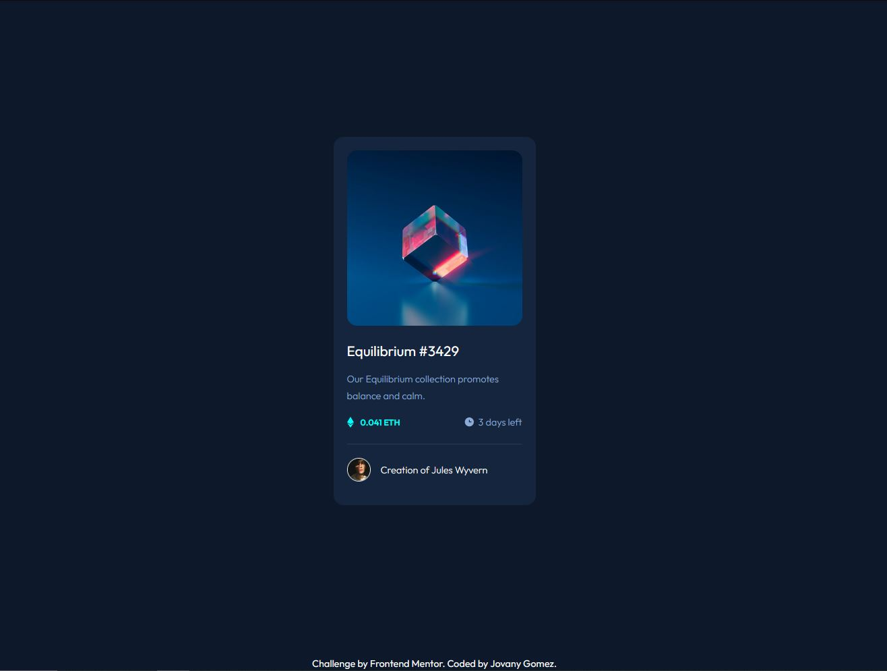

# Frontend Mentor - NFT preview card component solution

This is a solution to the [NFT preview card component challenge on Frontend Mentor](https://www.frontendmentor.io/challenges/nft-preview-card-component-SbdUL_w0U). Frontend Mentor challenges help you improve your coding skills by building realistic projects. 

## Table of contents

- [Overview](#overview)
  - [The challenge](#the-challenge)
  - [Screenshot](#screenshot)
  - [Links](#links)
- [My process](#my-process)
  - [Built with](#built-with)
  - [What I learned](#what-i-learned)
  - [Useful resources](#useful-resources)
- [Author](#author)

## Overview

### The challenge

The challenge of the NFT preview card component was to style a card like element where users can view information about a digital currency (the soultion uses ETH as the currency). The card contains a title, descrption, currency, time, profile picture and the author. 

### Screenshot



### Links

- Solution URL: https://github.com/jovanydev/frontend-mentor-challenges/tree/main/3-nft-preview-card-component

- Live Site URL: https://jovanydev.github.io/frontend-mentor-challenges/3-nft-preview-card-component/

## My process

### Built with

- Semantic HTML5 markup
- CSS custom properties
- Flexbox
- Mobile-first workflow


### What I learned

I learn how to include an overaly to elements. First create a container of the image. Add the img, a background element, and an icon elment with its class container. Then you make the container of the image a position relative. The background element and icon element are position absolute with opacity at 0 in the css. Using the hover attribute display the elements with opactiy anything over a 0.1.

To see how you can add code snippets, see below:

```html
<div class="card--img-container">
        
        <div class="card--img-over-bg"></div>
        <div class="card--img-over-center">
          
        </div>
      </div>```
```css
.card--img-container {
  position: relative;
}

.card--img-main {
  border-radius: 15px;
  margin-bottom: 1.5em;
  transform: 0.5s ease;
  backface-visibility: hidden;
}

.card--img-over-bg {
  position: absolute;
  top: 0;
  bottom: 0;
  left: 0;
  right: 0;
  height: 100%;
  width: 100%;
  opacity: 0;
  transition: 0.5s ease;
  border-radius: 15px;
  background-color: hsl(var(--clr-cyan));
}

.card--img-over-center {
  opacity: 0;
  position: absolute;
  top: 50%;
  left: 50%;
  transform: translate(-50%, -50%);
  -ms-transform: translate(-50%, -50%);
}

.card--img-container:hover .card--img-over-bg {
  opacity: 0.5;
  cursor: pointer;
}

.card--img-container:hover .card--img-over-center {
  opacity: 1;
  cursor: pointer;
}
```

### Useful resources

- [Example resource 1]https://www.w3schools.com/howto/howto_css_image_overlay.asp Give two examples of how to add overlay to elements. Works great.


## Author

- Website - Jovany Gomez (jovany.dev)
- Frontend Mentor - @jovanydev
(https://www.frontendmentor.io/profile/jovanydev)
- Twitter - @itsjovany
(https://twitter.com/itsjovany)
