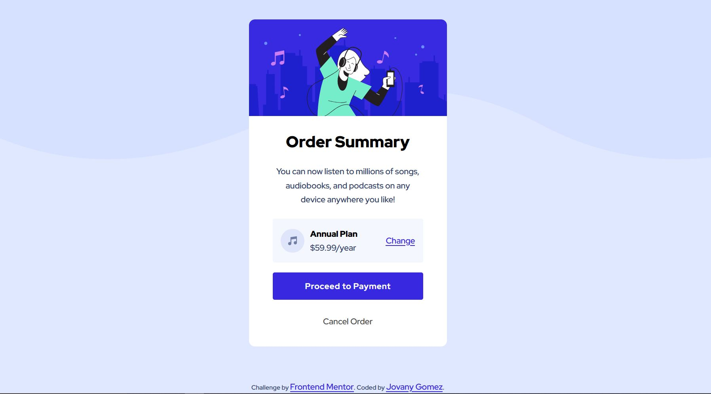

# Frontend Mentor - Order summary card solution

This is a solution to the [Order summary card challenge on Frontend Mentor](https://www.frontendmentor.io/challenges/order-summary-component-QlPmajDUj). Frontend Mentor challenges help you improve your coding skills by building realistic projects.

## Table of contents

- [Overview](#overview)
  - [The challenge](#the-challenge)
  - [Screenshot](#screenshot)
  - [Links](#links)
- [My process](#my-process)
  - [Built with](#built-with)
- [Author](#author)

## Overview

### The challenge

The challenge of the Order Summary component was to style a card with the information of a summary order. The user should be able to read the detail and subscription plan. Then be able to proceed with the payment or cancel order. They can also change the plan. This is just a User Iterface no interactive links or buttons.

### Screenshot

### Links

- Solution URL: https://github.com/jovanydev/frontend-mentor-challenges/tree/main/4-order-summary-component

- Live Site URL: https://jovanydev.github.io/frontend-mentor-challenges/4-order-summary-component/

## My process

### Built with

- Semantic HTML5 markup
- CSS custom properties
- Flexbox
- Mobile-first workflow

## Author

- Website - Jovany Gomez (jovany.dev)
- Frontend Mentor - @jovanydev
  (https://www.frontendmentor.io/profile/jovanydev)
- Twitter - @itsjovany
  (https://twitter.com/itsjovany)
